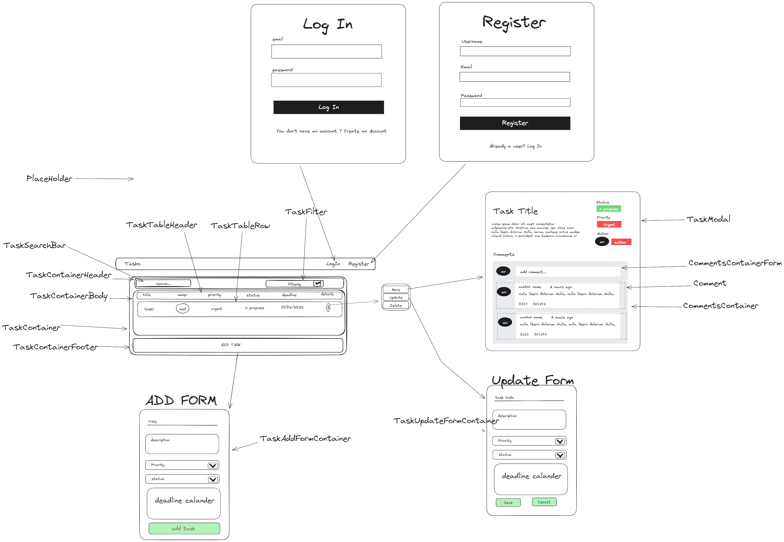
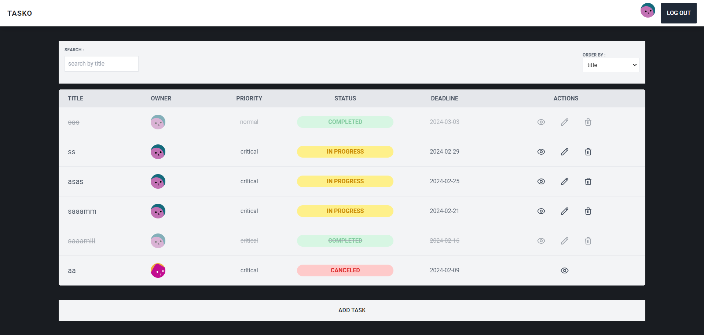
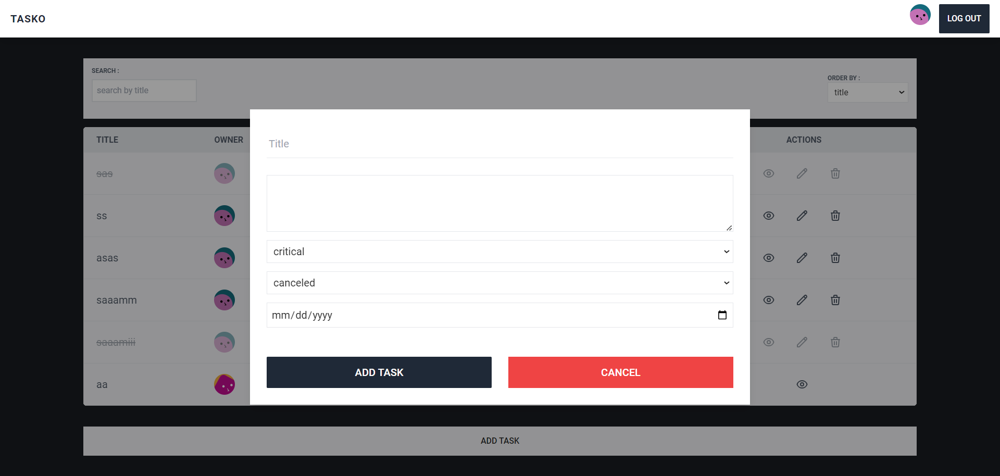
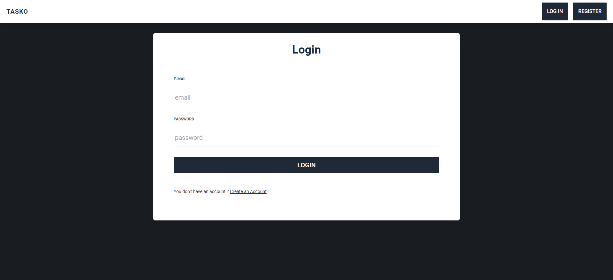
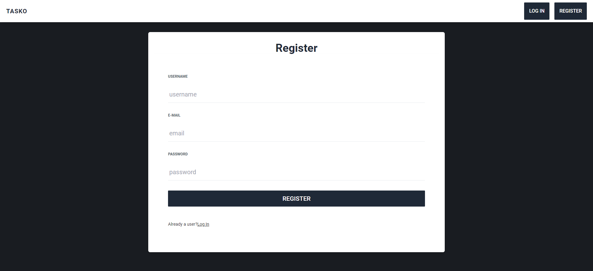

**<h1 align="center" style="border:none;text-decoration:underline">Todo List </h1>**
**_<h2 align="center" style="border:none;text-decoration:underline">Full Stack WEB APP </h2>_**

# Overview

Tasko is full stack web app that provides the ability to create,read,update and delete tasks. each user can manage their own tasks as well as add comments to other tasks created by other users.

# Thought Process

even though design is not one of my strongest points I wanted to include this one here to showcase what I did before diving into creating the layout using react and tailwindcss.


<br/>
<br/>
<br/>
  
# Screenshots

<details open>
  <summary>Home page</summary>
    
</details>

<details>
  <summary>Add task page</summary>
    
</details>

<details>
  <summary>Login Page</summary>
    
</details>

<details>
  <summary>Register Page</summary>
    
</details>

<br/>
<br/>

# Technologies

this project was built using the following technologies :

### Backend

-   [**NodeJs**]() : JavaScript runtime environment.
-   [**ExpressJs**]() : Middleware driven framework for building servers.
-   [**mongoose**]() : Object Document Modeling tool for MongoDB.
-   [**MongoDB**]() : NoSql DataBase .
-   [**jest**]() : JavaScript testing library.

### Frontend

-   [**React**](https://jwt.io/) : Component based library for building user interfaces.
-   [**Tailwindcss**]() : Utility first css framework for building user interfaces.

-   [**Json Web Tokens**](https://jwt.io/) : JSON Web Tokens are an open, industry standard RFC 7519 method for representing claims securely between two parties..

And many more ..., You can refer to [package.json](./package.json) file for more details

<br/>

# Features

-   Register/ login : create your own account to manage tasks.
-   create, read, update and delete : you can add your own tasks modify them and delete them as you see fit.
-   Search : search for a specific task by title.
-   Filtering : filter tasks list by title , status, priority or deadline.
-   JWT routes protection : a user can view , edit and delete his own tasks but can only view other users tasks.

<br/>

# How To use

```bash
# Clone this repository
$  git clone https://github.com/MedtheVorg/TodoList-MERN-.git

# Go into the repository
$ cd TodoList-MERN-

# install dependencies
$ npm install

# add .env file
 - Create a .env file in the root directory and add  the following environment variables :
  PORT = ""
  VITE_MONGODB_URL = ""

# generate Pem encoded keys
  if you wish to use your own keys I advise you to generate new ones and replace the two files in the keys folder. otherwise you can use the existing ones.

# Run the server
$ npm start

# Run tests
to run tests use the following command :
$ npm test

```

<br/>

## Contributors

<table width="100%"><tr align="left">

  <td align="center"><a href="https://github.com/Mehdi-012"><br/><sub><b>Mehdi-012
 </b></sub></a></td>
  <td align="center"><a href="https://github.com/MedtheVorg"><br/><sub><b>Mohamed Lem
</b></sub></a></td>
</tr>
</table>

<br />
<br />

# Contributing

If you'd like to contribute code, documentation, or other enhancements, please follow these general steps:

## How to Contribute

1. Fork the repository.
2. Create a new branch for your changes.
3. Make your changes and test them thoroughly.
4. Create a pull request with a clear title and description.

Thank you for helping improve this project!

<br/>

# License

This project uses the [MIT License](https://mit-license.org/). The MIT License (MIT)
Copyright © 2024 <copyright holders>

Permission is hereby granted, free of charge, to any person obtaining a copy of this software and associated documentation files (the “Software”), to deal in the Software without restriction, including without limitation the rights to use, copy, modify, merge, publish, distribute, sublicense, and/or sell copies of the Software, and to permit persons to whom the Software is furnished to do so, subject to the following conditions:

The above copyright notice and this permission notice shall be included in all copies or substantial portions of the Software.

THE SOFTWARE IS PROVIDED “AS IS”, WITHOUT WARRANTY OF ANY KIND, EXPRESS OR IMPLIED, INCLUDING BUT NOT LIMITED TO THE WARRANTIES OF MERCHANTABILITY, FITNESS FOR A PARTICULAR PURPOSE AND NONINFRINGEMENT. IN NO EVENT SHALL THE AUTHORS OR COPYRIGHT HOLDERS BE LIABLE FOR ANY CLAIM, DAMAGES OR OTHER LIABILITY, WHETHER IN AN ACTION OF CONTRACT, TORT OR OTHERWISE, ARISING FROM, OUT OF OR IN CONNECTION WITH THE SOFTWARE OR THE USE OR OTHER DEALINGS IN THE SOFTWARE.
